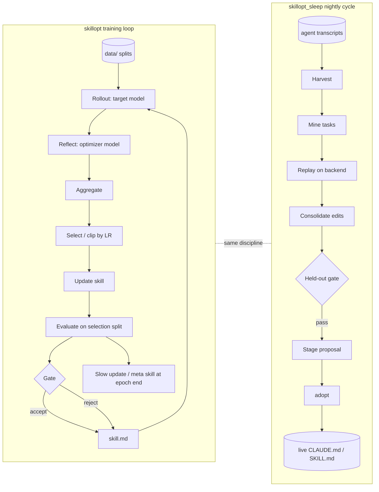

# Architecture

SkillOpt treats a natural-language **skill document** like model weights: it is improved by a training loop whose "gradients" are LLM-written edit patches, "clipped" by a learning rate, and accepted only through a validation gate. The repo ships two systems that share the idea but not code.

## 1. Research training loop (`skillopt/`)

Entry: `scripts/train.py` (`skillopt-train`) builds an `EnvAdapter` from a lazily-populated `_ENV_REGISTRY` and runs `skillopt/engine/trainer.py:ReflACTTrainer.train()`.

| Stage | Module | Notes |
|---|---|---|
| Rollout | `EnvAdapter.rollout` in `skillopt/envs/<env>/rollout.py` | target model runs tasks with the current skill; returns `hard`/`soft` scores + trajectories |
| Reflect | `skillopt/gradient/reflect.py`, env `reflect.py`, prompts `skillopt/prompts/analyst_*.md` | optimizer model analyzes minibatches (failures always; successes unless `gradient.failure_only`) into edit patches |
| Aggregate | `skillopt/gradient/aggregate.py` (`merge_patches`) | hierarchical merge of similar patches (`merge_*.md` prompts) |
| Select | `skillopt/optimizer/clip.py` (`rank_and_select`), `scheduler.py`, `lr_autonomous.py` | learning rate = max edits per step; schedulers cosine/linear/constant |
| Update | `skillopt/optimizer/skill.py` (`apply_patch_with_report`), `rewrite.py`, `update_modes.py`, `appendix.py`, `skill_aware.py` | patch or full-rewrite modes |
| Evaluate / gate | `skillopt/evaluation/gate.py` (`evaluate_gate`, `select_gate_score`) | metric `hard`/`soft`/`mixed`; accept only if strictly better unless `evaluation.use_gate: false` |
| Epoch boundary | `skillopt/optimizer/slow_update.py`, `meta_skill.py` | longitudinal comparison guidance and cross-epoch strategy memory |

Config: `skillopt/config.py` + YAML in `configs/` (`_base_/default.yaml`, per-env, `features/soft_gate.yaml`), CLI overrides via `--cfg-options section.key=value`. Output dir: `outputs/...` (gitignored), set by `--out_root`.

### Backends (`skillopt/model/`)
`router.py` selects the active module (`azure_openai`, `codex`, `claude`) from `REFLACT_MODEL_BACKEND`; `common.py:normalize_backend_name` maps aliases (`openai_chat`, `claude_chat`, `claude_code_exec`, `codex_exec`, `cursor_exec`, `copilot_chat`, `copilot_exec`, `qwen_chat`, `minimax_chat`, `openai_compatible`). Optimizer and target roles are resolved independently (`trainer.py:_resolve_role_backends`). Modules: `azure_openai.py`, `openai_compatible_backend.py`, `claude_backend.py` (claude CLI), `claude_code_backend.py`, `codex_backend.py`, `codex_harness.py` (exec harnesses incl. cursor/copilot), `copilot_backend.py`, `qwen_backend.py`, `minimax_backend.py`.

### Environments (`skillopt/envs/`)
`alfworld`, `docvqa`, `livemathematicianbench`, `officeqa`, `searchqa`, `spreadsheetbench`, plus `_template/` and `base.py` (`EnvAdapter`). Splits live in `data/*_split/`; reference checkpoints in `ckpt/`.

## 2. SkillOpt-Sleep (`skillopt_sleep/`)

Entry: `skillopt-sleep` / `python -m skillopt_sleep` (`__main__.py`). Orchestrator: `cycle.py:run_sleep_cycle`.

`harvest` (`harvest.py`, `harvest_{codex,copilot,copilot_cli,cursor,opencode,pi}.py`, `harvest_sources.py`) -> `mine` (`mine.py`, `llm_miner.py`, `tasks_file.py`) -> `replay` (`replay.py`, `rollout.py`, `judges.py`) -> `consolidate` (`consolidate.py`, `dream.py`, `slow_update.py`, `multi_skill.py`) behind a held-out `gate` (`gate.py`) -> `stage` (`staging.py`) -> optional `adopt`. State and evidence: `state.py`, `evidence.py` (`evidence.jsonl`), `.skillopt-sleep/` (gitignored). Statistical A/B: `evalkit.py` (McNemar + bootstrap). Scheduling: `scheduler.py` (cron, schtasks). Backends: `backend.py` (`Backend` base, `MockBackend`, `CliBackend` subclasses for Claude/Codex/Copilot/Cursor/Pi/OpenCode, `AzureOpenAIBackend`, `AzureResponsesBackend`, `DualBackend`, `get_backend`), `handoff_backend.py` (no model call; session answers prompts).

Safety model: staged proposals only; adoption via versioned manifest with provenance hashes and backups (`staging.py`); secrets redacted (`redact_secrets`).

## 3. Surfaces
- `skillopt_webui/app.py`: Gradio UI that spawns `scripts/train.py` as a subprocess (`TrainingProcess`), `--host/--port/--share`.
- `plugins/*`: agent integrations calling the Sleep CLI (see `AGENTS.md`).
- `docs/` + `mkdocs.yml`: documentation site.

## Data flow

## ADRs (inferred from code and docs)
- **Gate before accept**: candidates are validated on a held-out split; rejected candidates are recorded (`gate.py` in both packages).
- **Sleep decoupled from research package**: `skillopt_sleep` has no runtime dependency on `skillopt/` (`plugins/README.md`, `pyproject.toml` comments).
- **Lazy env registration**: adapters import on demand so optional deps (alfworld, vllm) are not required.
- **Staging + explicit adopt**: live files change only on `adopt` or `--auto-adopt`.

## Note: registry vs. shipped envs
`scripts/train.py` lazily registers `alfworld`, `searchqa`, `livemathematicianbench`, `babyvision`, `spreadsheetbench`, `mmrb`, `docvqa`, `mathverse`, `officeqa`, `sealqa`, `swebench`; each import is wrapped in `except ImportError`. Only alfworld, docvqa, livemathematicianbench, officeqa, searchqa, spreadsheetbench exist under `skillopt/envs/`; the rest are silently skipped (see `docs/known-issues.md`).
